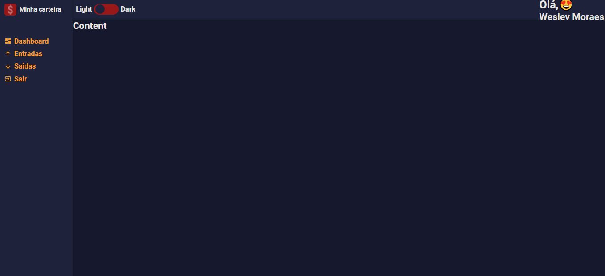
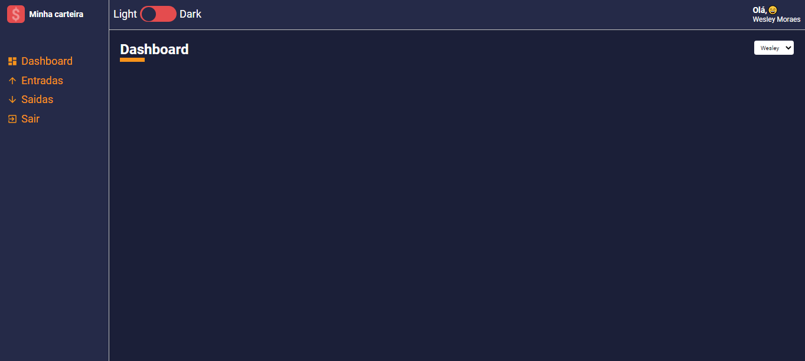
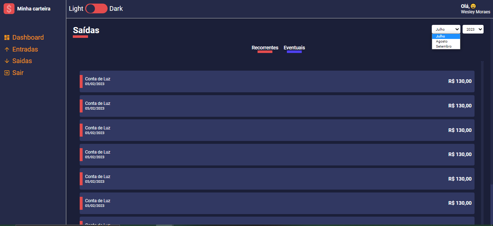

# Projeto

Este projeto consiste na criação de uma aplicação usando o react juntamente ao typescript. Essa aplicação será uma carteira digital que irá ter o controle de finanças pessois.

## Tecnologias

* react
* typescript
* style-components
* react-icons

## Andamento do Projeto

## 1

 
    

## 2

 
    

## 3

 
    

## 4

 
    

