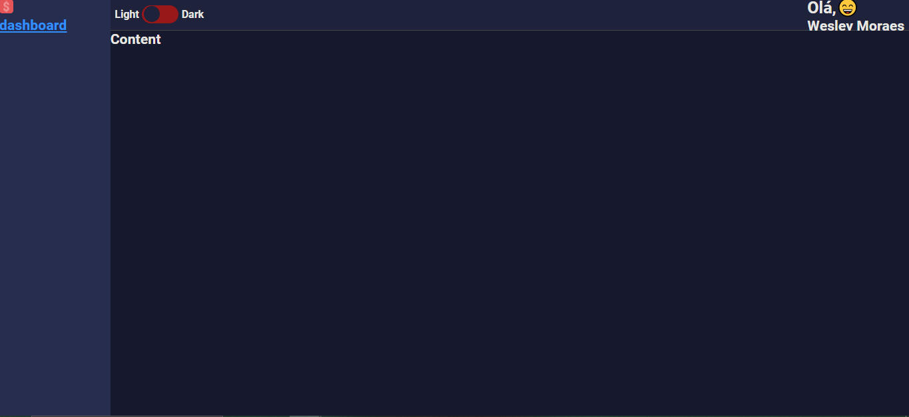
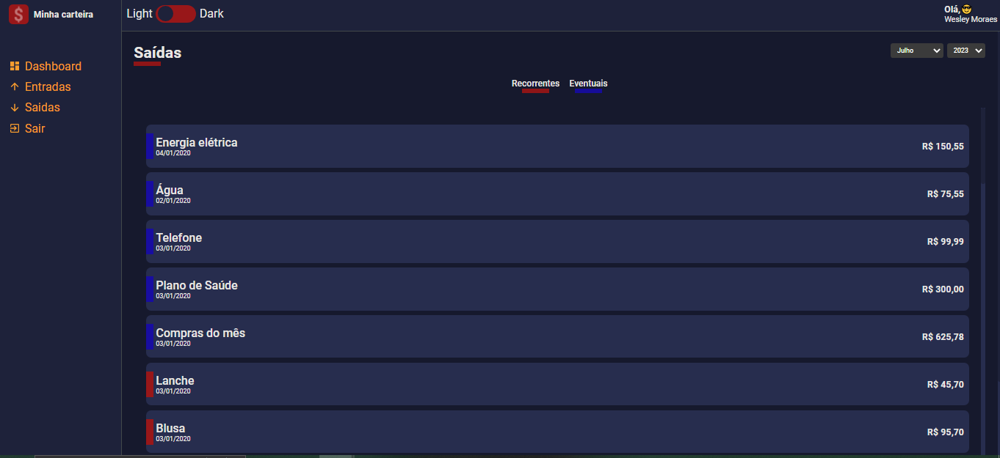
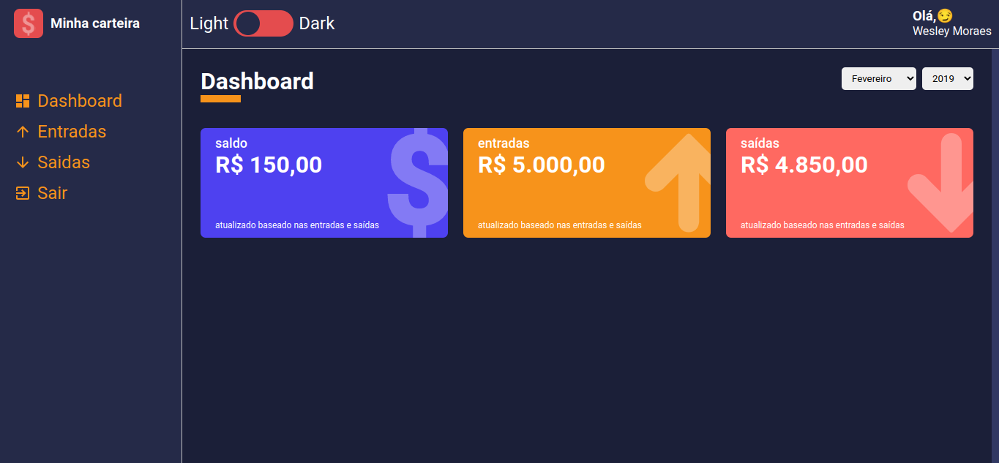
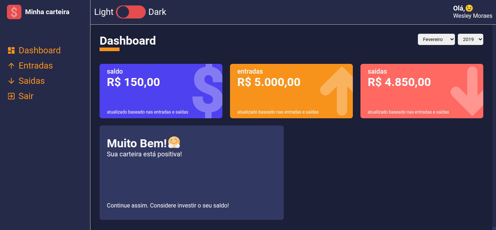
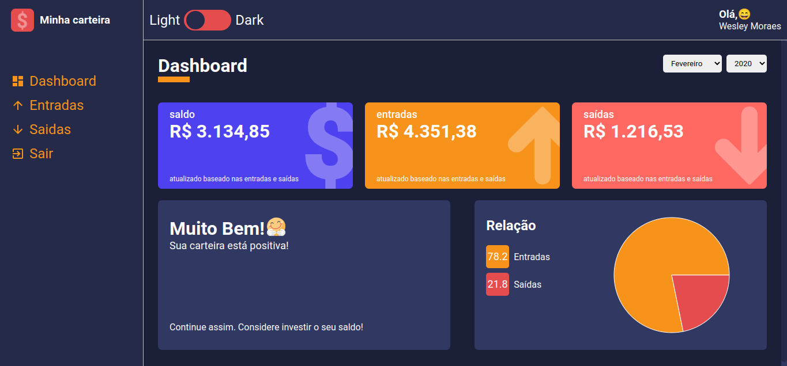
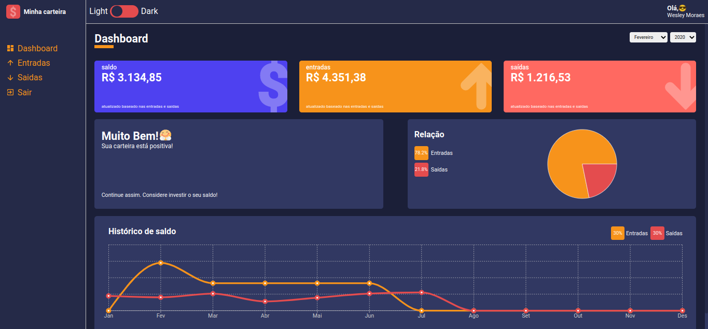
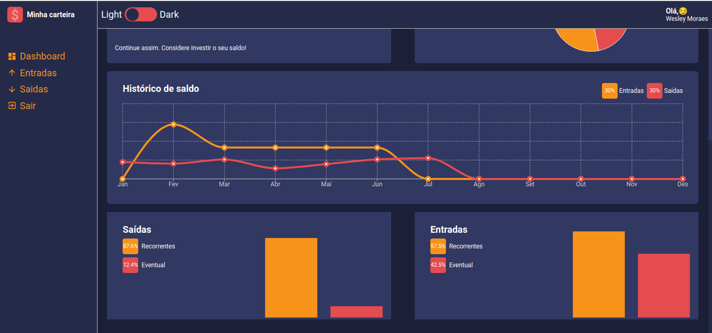

# Projeto

Este projeto consiste na criação de uma aplicação usando o react juntamente ao typescript. Essa aplicação será uma carteira digital que irá ter o controle de finanças pessois.

## Tecnologias

- react
- typescript
- style-components
- react-icons

## Andamento do Projeto

## 1

 
    

## 2

 
    

## 3

 
    

## 4

 
    

## 5

 
    

## 6

 
    

## 7

 
    

## 8

 
    

## 9

 
    

## 10

 
    

